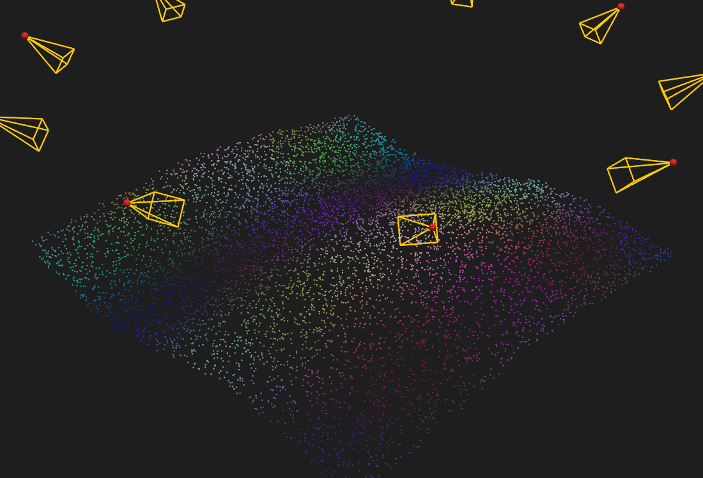

# CloudLabeller

**CloudLabeller streamlines object annotation in 3D point clouds.** It takes
you from a folder of photos to a dense, fully labelled point cloud in one
desktop app: reconstruct the scene photogrammetrically, label a handful of
images — or paint the cloud directly — and let camera projection and a U-Net
propagate the labels to everything else.



Manually classifying millions of points is the bottleneck of every
photogrammetric mapping workflow. CloudLabeller attacks it from both sides:
labels drawn on **2D images** are projected onto the **3D cloud**
(visibility-aware voting across views), labels on the cloud are projected
back onto every image, and a U-Net trained on the few images you touched
predicts the rest. Built for geological outcrop mapping, but suited to any
survey where per-point classes matter.

## Features

**Photogrammetry** (COLMAP / pycolmap)
- Structure-from-Motion with spatial (GPS), sequential or exhaustive
  matching; GPU SIFT + matching via CUDA COLMAP, with automatic CPU fallback.
- Dense multi-view stereo with resolution presets, a fast *Draft* quality
  mode, and crash-resumable workspaces.
- Meshing: Poisson (depth auto-matched to the cloud's density, with run-time
  and RAM estimates) or Delaunay, rebuilt automatically after MVS.
- Georeferencing to the images' EXIF GPS (metric, true-north local frame).
- A one-click **full pipeline** (SfM → MVS → mesh) for overnight runs — the
  machine is kept awake and every stage logs to the project.
- COLMAP is **not** bundled: *Photogrammetry → Download COLMAP…* fetches the
  official release on demand (CUDA or CPU-only, auto-detected).

**Labelling**
- Draw polygon labels on images or select points/faces on the cloud and mesh
  with a shared class schema (colours, hotkeys) and full undo/redo.
- Bidirectional transfer: *Images → Cloud* (multi-view voting) and
  *Cloud → Images* (per-pixel masks), both visibility-aware.
- An image-overlap (covisibility) graph from the SfM solve keeps every
  transfer restricted to the images that actually see the labelled area.
- Per-image status dots show label provenance at a glance: user-drawn,
  projected/predicted, or unlabelled.

**Machine learning**
- Train a U-Net on your labelled images (TensorFlow), predict the whole
  image store, and send the predictions to the cloud — label a few images,
  annotate the entire survey.

**Data interchange**
- Export labelled clouds to `.las`, `.ply` or `.csv` and meshes to `.ply`,
  `.obj` or `.stl` for GIS and geomodelling tools.
- Projects are plain folders — copy them between machines as-is.

## Getting started

CloudLabeller is not published on PyPI — install it from this repository.

**Run from source** (Python 3.10; developed and tested on Windows):

```bash
git clone https://github.com/italo-goncalves/cloudlabeller.git
cd cloudlabeller
pip install -r requirements.txt   # dependencies only, pinned — see notes inside
python -m cloudlabeller
```

**Build the portable Windows distribution** — a self-contained folder with
its own embedded Python that runs on machines with no Python installed:

```bash
python scripts/build_portable.py --out C:/Temp/cl_build
```

The script downloads the embeddable Python 3.10, installs the requirements
into it (~2 GB — be patient), copies the app and writes the launchers
(`CloudLabeller.vbs` / `.bat`); zip the resulting `CloudLabeller` folder to
distribute it. By default your local COLMAP bundle (`~/.cloudlabeller/colmap`,
if present) is included; pass `--skip-colmap` for a much smaller archive —
recipients can then fetch COLMAP in-app via *Photogrammetry → Download
COLMAP…*.

An NVIDIA GPU is required for dense MVS (CUDA); everything else — SfM,
labelling, training, prediction — runs on the CPU.

Development: architecture in [DESIGN.md](DESIGN.md); tests with
`QT_QPA_PLATFORM=offscreen PYVISTA_OFF_SCREEN=true pytest tests/ -q`.

## Typical workflow

1. **File → New Project…**, then **Add Images…** to fill the image store.
2. **Photogrammetry → Run Full Pipeline…** (or run SfM / MVS / mesh
   individually). Georeference when the reconstruction is final.
3. Label a few well-chosen images (or paint the cloud) and run
   **Transfer → Images → Cloud**.
4. **Model → Train U-Net…**, then **Predict All Images…** and transfer again
   — refine and repeat until the cloud is clean.
5. **File → Export Point Cloud… / Export Mesh…**

## AI-assistance disclaimer

CloudLabeller is an AI-assisted project: most of its application code was
written, tested and debugged by an AI coding assistant (Anthropic's Claude)
under the direction of the author, who defined the requirements, the
scientific approach and the machine-learning methodology. As with any
software, validate results independently before scientific or operational
use.

## License

CloudLabeller is **dual-licensed**:

- **GNU GPL v3 or later** — see [LICENSE](LICENSE). Free to use, modify and
  redistribute; software that incorporates or redistributes it must remain
  under the GPL.
- **Commercial license** — for use in closed-source products or
  redistribution outside the GPL's terms, a separate commercial license is
  available from the author: Ítalo Gomes Gonçalves
  <italogoncalves.igg@gmail.com>.

Third-party components keep their own licenses; binary distributions include
the full collection in `THIRD_PARTY_LICENSES.txt`. COLMAP is **not** shipped
with CloudLabeller — the app downloads the official release on demand
(Photogrammetry → Download COLMAP…).

### Contributing

To keep the dual-licensing model possible, external contributions can only
be accepted with a copyright assignment (CLA) — please contact the author
before opening a pull request.

## Citing

If you use CloudLabeller in research, please cite the software — see
[CITATION.cff](CITATION.cff) (GitHub's *Cite this repository* button
generates BibTeX/APA from it).
